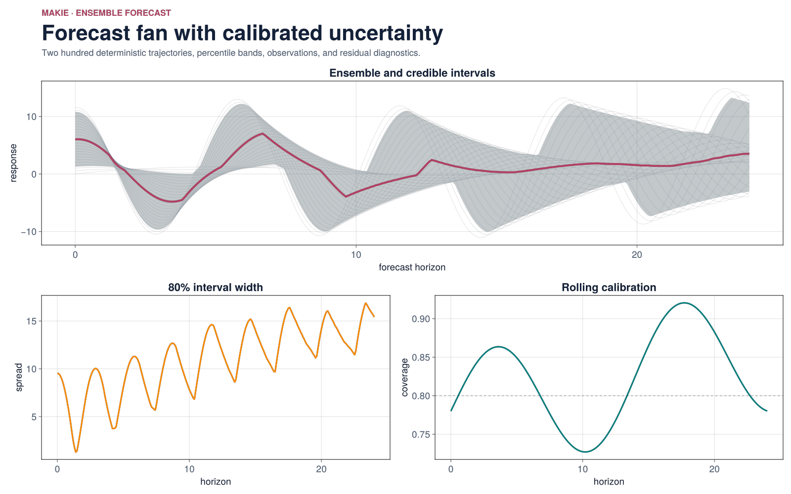
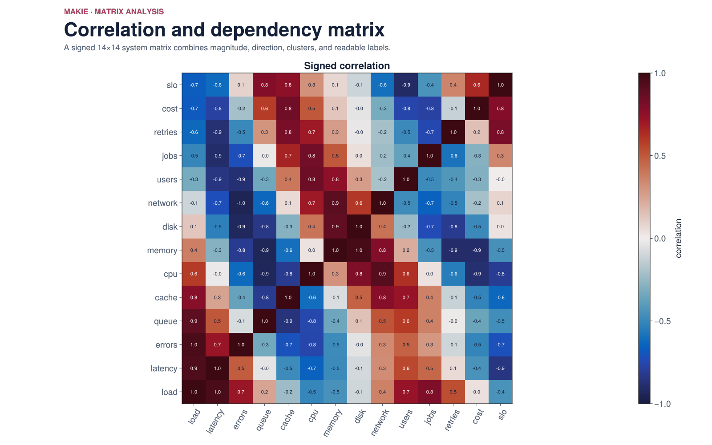
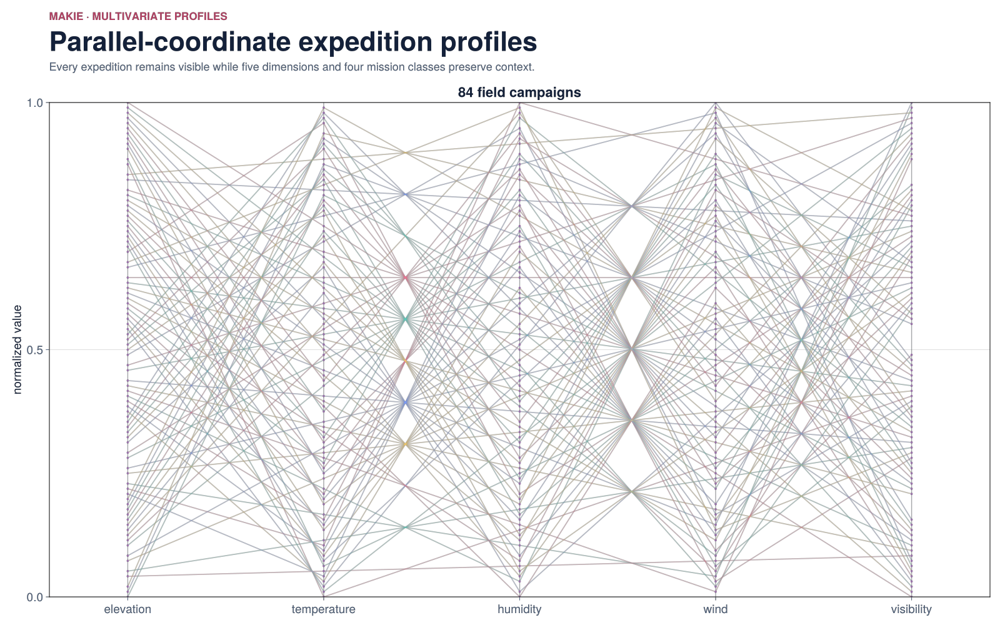
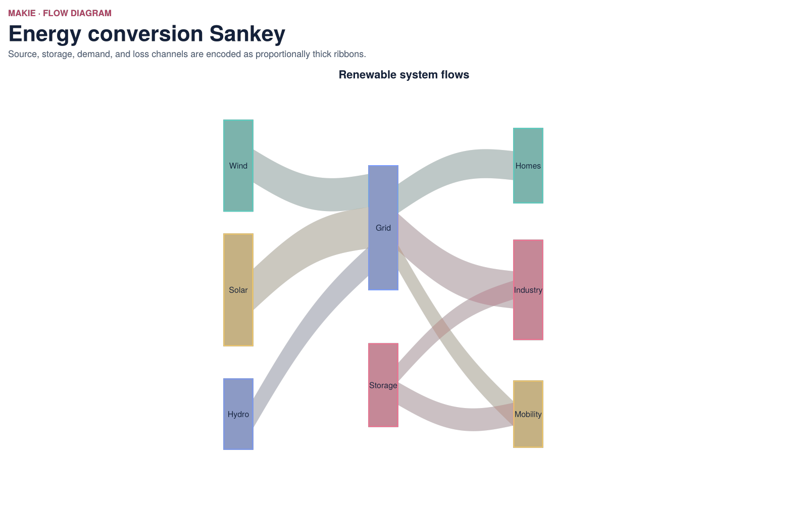
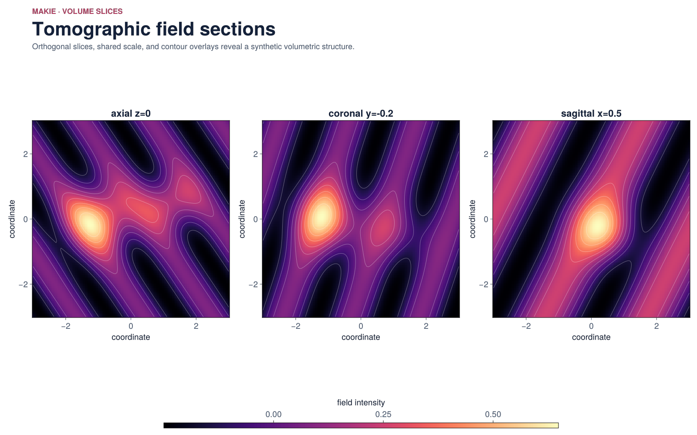
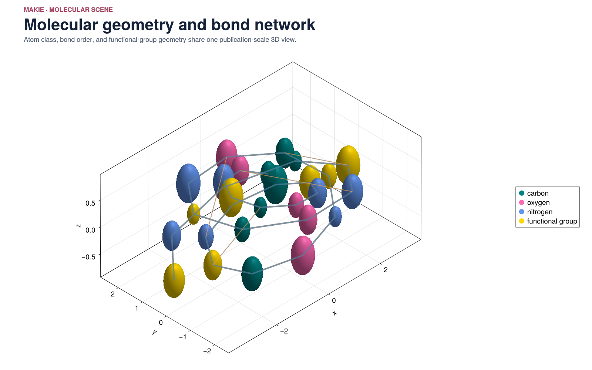
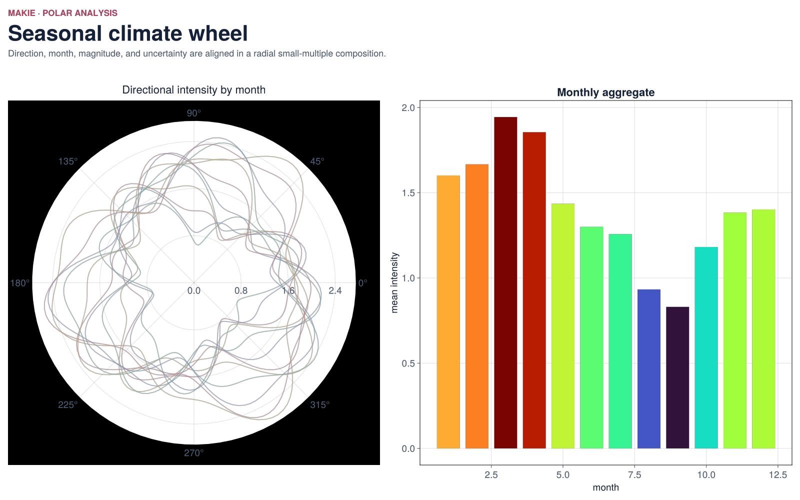
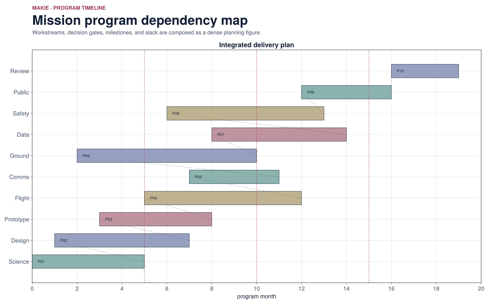
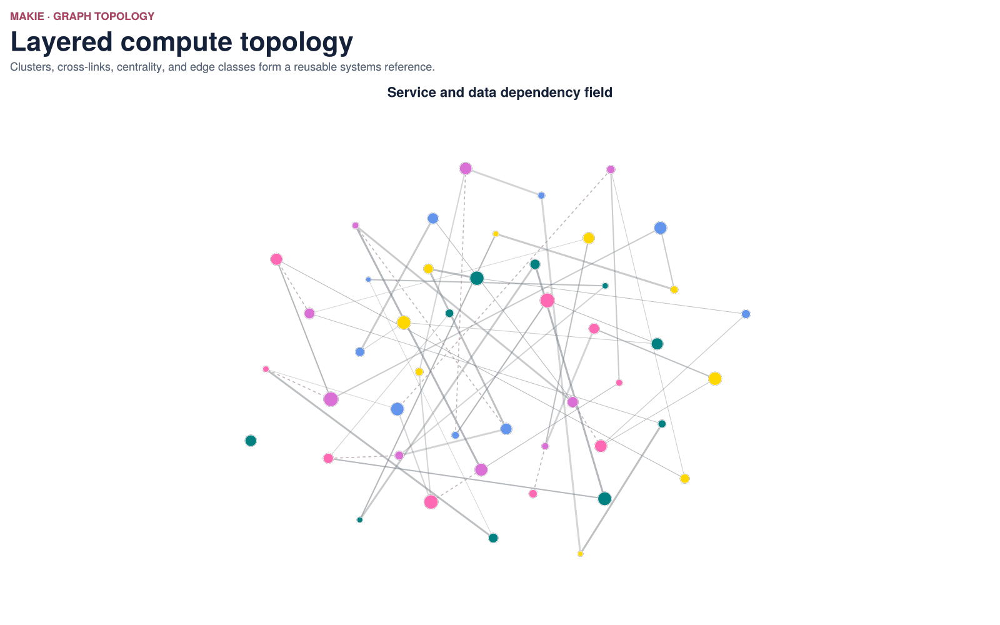

# makie-demos

Twelve polished, publication-scale figures built with CairoMakie. The primary outputs are 1600×1000 background-transparent PNG files; GLMakie remains available for adapting the same scene graph to interactive windows.

```bash
julia --project=. scripts/render.jl
julia --project=. -e 'using Pkg; Pkg.test()'
```

The scenes span 2D, 3D, statistical, flow, matrix, molecular, polar, timeline, topology, and multi-panel compositions. Every output has an adjacent JSON manifest and is checked for transparent, visible, and colorful pixels.

## Transparent PNG reference gallery

`catalog.json` supplies searchable intent and family metadata.

| 3D surface | Vector field | Phase dashboard | Forecast fan |
|---|---|---|---|
|  |  |  |  |
| Correlation matrix | Parallel coordinates | Sankey | Volume slices |
|  |  |  |  |
| Molecule | Polar climate | Gantt | Topology |
|  |  |  |  |
