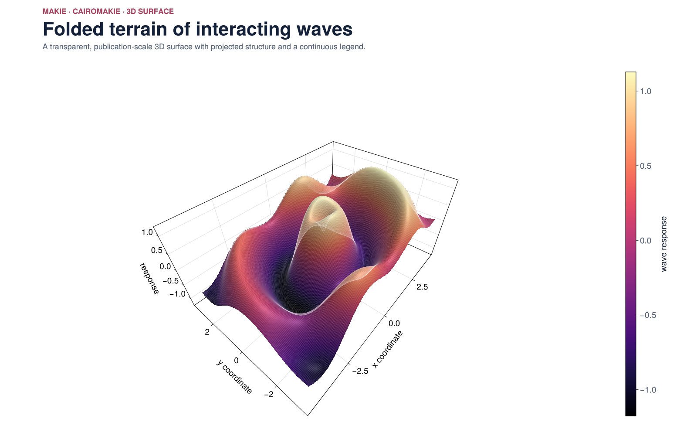
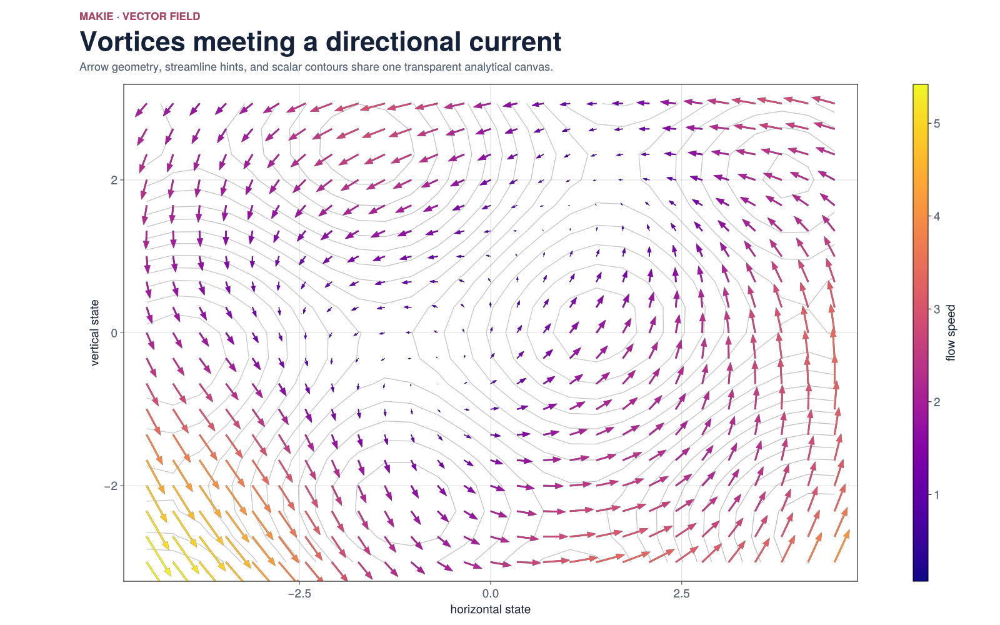
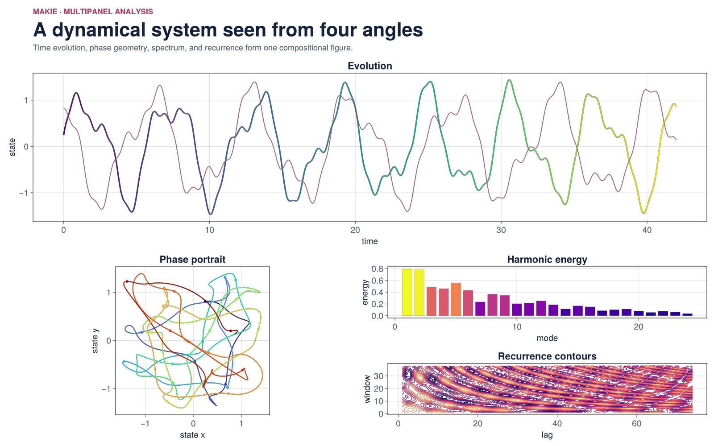

# makie-demos

Three polished, publication-scale figures built with CairoMakie. The primary outputs are 1600×1000 background-transparent PNG files; GLMakie remains available for adapting the same scene graph to interactive windows.

```bash
julia --project=. scripts/render.jl
julia --project=. -e 'using Pkg; Pkg.test()'
```

The scenes cover a shaded 3D surface, a vector field, and a multi-panel dynamical-system dashboard. Every output has an adjacent JSON manifest and is checked for transparent, visible, and colorful pixels.

## Transparent PNG gallery

| 3D surface | Vector field | Phase dashboard |
|---|---|---|
|  |  |  |
